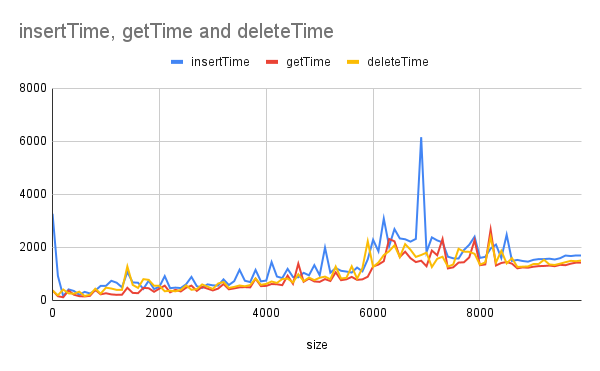
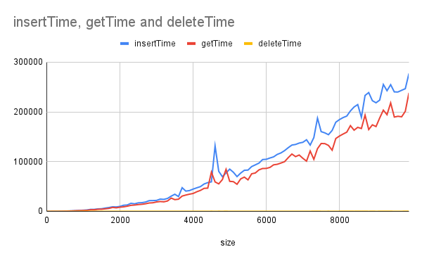
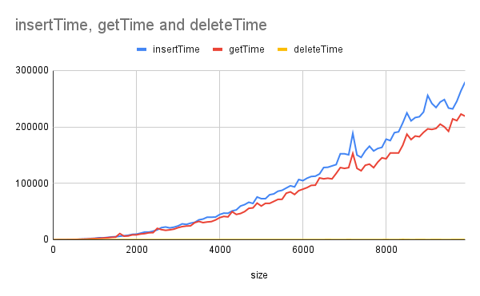
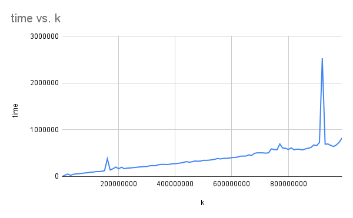

# projector-algorithms

- Implements balanced BST tree and compares complexity for insert, get, delete elements
- Implements counting sort

# BST

### [Implementation](./BST.java)
### [Test cases](./ApplicationBST.java)

## Results

### Generate 100 datasets with random elements

[File with results](docs/random.csv)

### Generate 100 datasets with sorted (ASC) elements

[File with results](docs/sortedAsc.csv)

### Generate 100 datasets with sorted (DESC) elements

[File with results](docs/sortedDesc.csv)

# Counting Sort

### [Implementation and Tests](./ApplicationCountingSort.java)

### Analysis

In tests, we used array with size `100_000` random elements and compared with `100` data sets with 
different `K` parameter values - between `100` and `990000100`

[test results](docs/sort.csv)

As wee see, ff k is significantly larger than the number of input elements
n, counting sort can be inefficient because it requires allocating an array of size k.

Since counting sort uses an auxiliary array to count occurrences of values, it might not be ideal for environments with tight memory constraints.

Counting sort is not an in-place sorting algorithm. If you need to sort data in place without using extra space, then counting sort won't fit the bill.

If you need to sort floating point numbers, strings, or other complex data types, you can't use counting sort directly.

